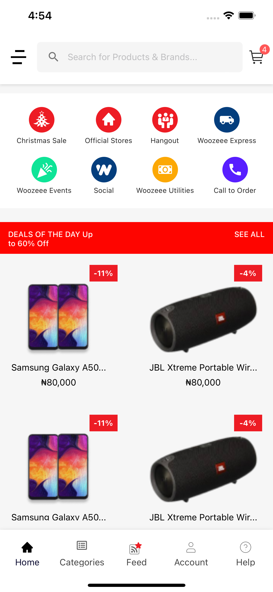
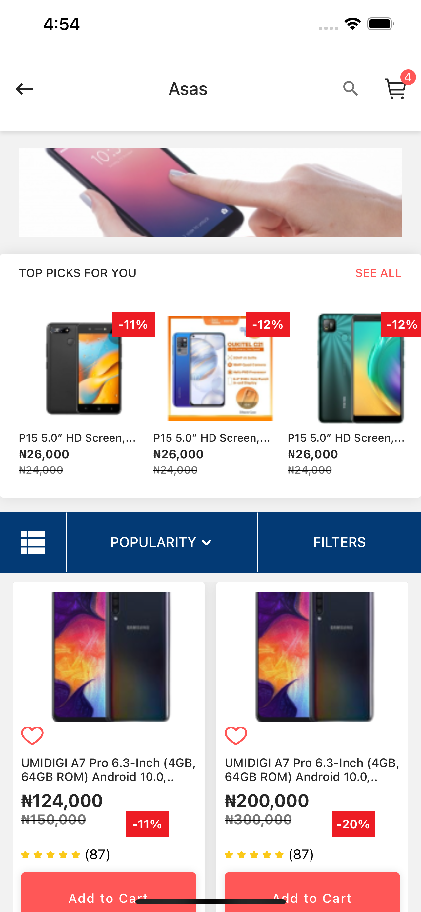
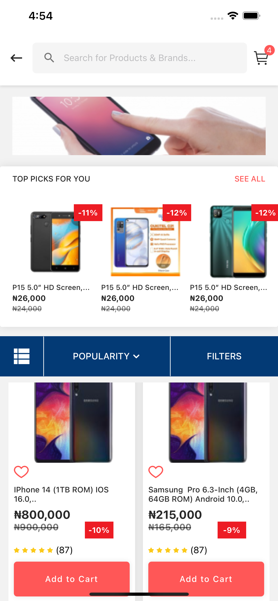
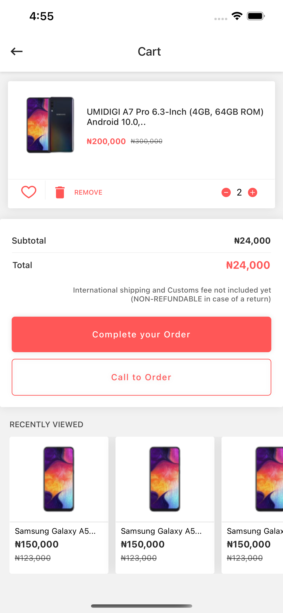
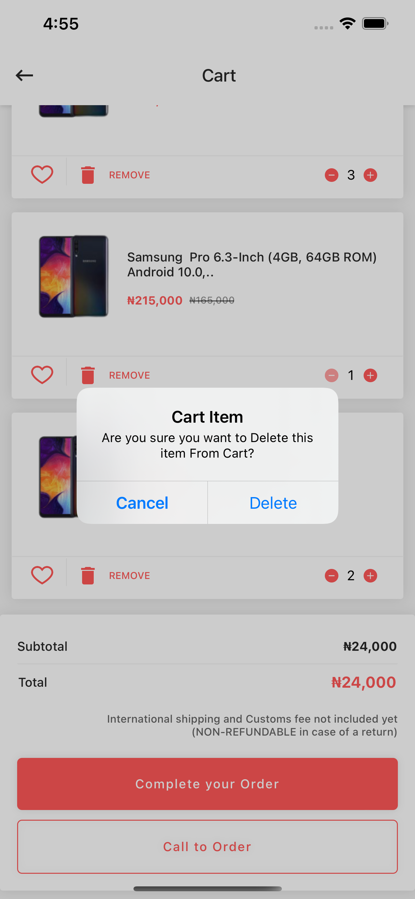

# ClickNShop
## Screenshots

## Getting started

clone or download this repository, navigate to the cloned or downloaded folder in your terminal.Run yarn start or npm start in your root folder, depending on your preference / the package manager available on your PC. There will be some listed instruction to follow, you can scan Barcode with your Real device through the Expo-client App and also use a Simulator or(and) an Emulator, Happy hacking!!!💥

## Prerequisite

NPM or YARN must be installed. Go to [Expo](expo.dev) to register for an account(if you don't have one). you can also download Expo-client app from playstore or Appstore to use a Real device while in development.

## Tech/Framework Used

- ReactNative

- Expo
- TypeScript
- StyledComponent

## Contact

You can reach me at <asiyanbimubashir@gmail.com>

## Author

### __Asiyanbi Mubashir__
